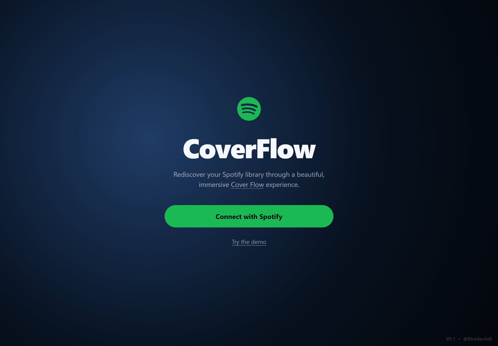

# CoverFlow for Spotify

Browse your Spotify liked tracks and playlists through an immersive CoverFlow experience.

**Live demo:** [steelskies.com/coverflow](https://www.steelskies.com/coverflow/)

<p align="center">
  
  
</p>

## Features

- CoverFlow 3D effect with reflection
- Loads your Spotify liked tracks by default
- Paste any public Spotify playlist URL to browse it
- 15 built-in demo tracks (no Spotify account needed)

## Self-hosting

This is a pure static site — no build step, no server required.

### 1. Create a Spotify app

1. Go to [developer.spotify.com/dashboard](https://developer.spotify.com/dashboard)
2. Click **Create app**
3. Under **Redirect URIs**, add the URL where you'll host this (e.g. `https://your-username.github.io/Spotify-Coverflow/`)
4. Save — copy your **Client ID**

### 2. Add your Client ID

Copy the example config and add your Client ID:

```bash
cp config.example.js config.js
```

Then open `config.js` and replace the placeholder:

```js
const clientId = 'your_spotify_client_id_here';
```

`config.js` is gitignored — your Client ID stays off GitHub.

### 3. Host it

**GitHub Pages:**
Push to a GitHub repo → Settings → Pages → Deploy from branch → main → / (root)

**Local:**
```bash
python -m http.server 8000
# then open http://127.0.0.1:8000/
```
Add `http://127.0.0.1:8000/` as a Redirect URI in your Spotify app settings too.

## Public release

By default Spotify apps run in **Development Mode** — only users you manually add as testers can log in (max 25). To allow any Spotify user to connect, apply for **Extended Quota Mode** in your Spotify Developer Dashboard.

## Stack

Vanilla HTML · CSS · JavaScript — no frameworks, no dependencies.
